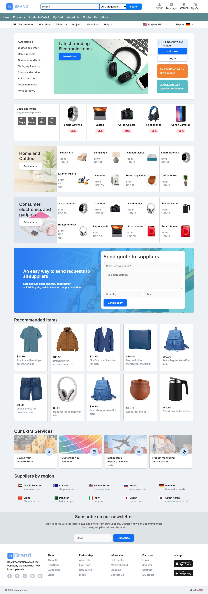
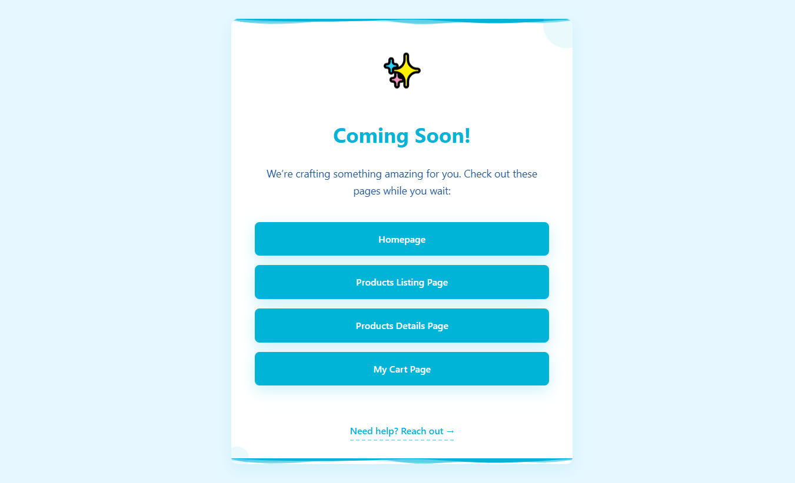
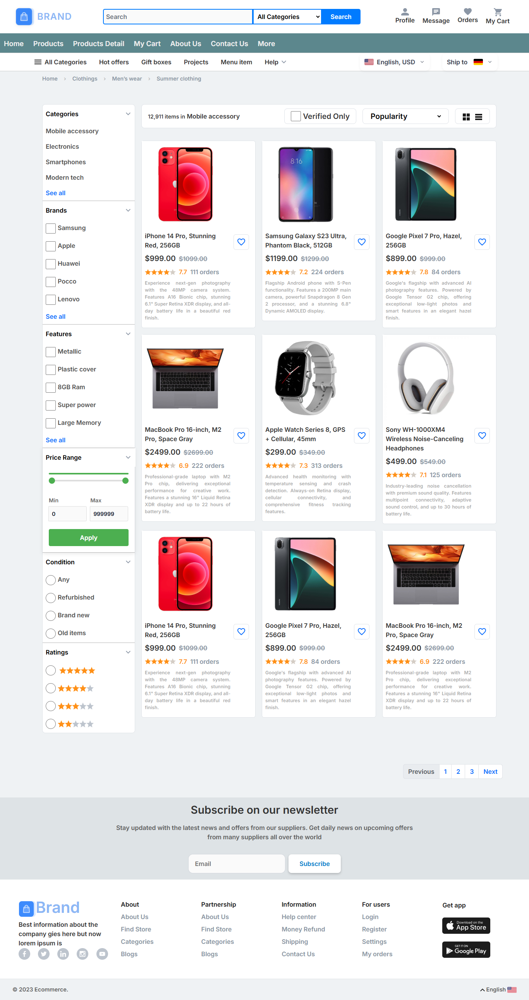
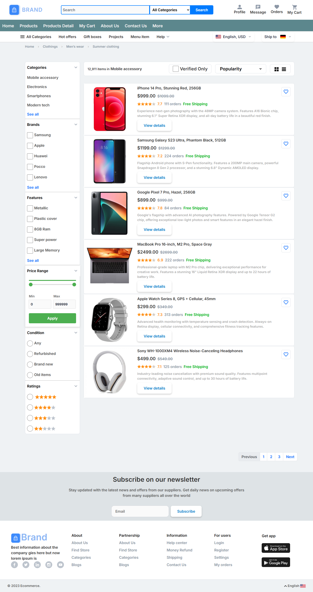
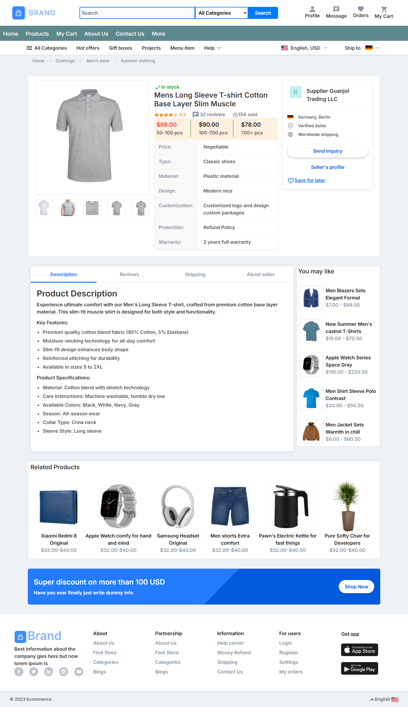
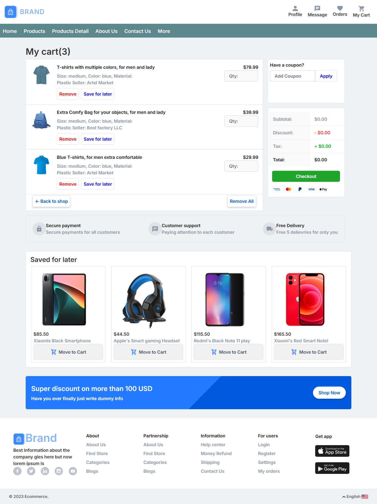

# E-Commerce Frontend (Desktop)



## 📌 Overview

A **desktop-optimized** eCommerce frontend featuring:

- Product listings with view toggles
- Interactive shopping cart
- Responsive header/footer components
- Utility pages (under-construction, 404)

## 🌟 **Key Features**

### 🛍️ Storefront

- **Dual-view listings**: Grid/List toggle
- **Product details**: Image gallery + specs
- **Cart management**: Quantity adjustment, item removal

---

### 🛠️ Utilities

- **Under-construction hub**: Redirects with alternative links
- **404 page**: Branded error handling



## ✅ Progress Timeline

### Week 1: Header & Footer

**Implemented**:

- 🖥️ Desktop header with:
  - Logo placement
  - Search functionality
  - Dropdown navigation
- 📜 Footer with:
  - Quick links
  - Contact information
- **Tech**: HTML5, CSS Flexbox


---

### Week 2: Product Views

**Added**:

- 🔄 View toggler (Grid ↔ List)
- 🔍 Filter system:
  - Category selection
  - Price range slider
- 🎨 Consistent product cards

  


---

### Week 3: Cart & Product Details

**Completed**:

- 🛒 Cart functionality:
  - Quantity +/- buttons
  - Item removal
- 📋 Product detail pages:
  - Image zoom
  - Specification tabs

  


## 🧰 Tech Stack

| Component      | Technology                |
| -------------- | ------------------------- |
| Structure      | HTML5 (Semantic markup)   |
| Styling        | CSS3 (Flexbox/Grid)       |
| Interactivity  | Vanilla JavaScript (ES6+) |
| Layout Helpers | Bootstrap (Minimal use)   |

## 🚀 Setup

1. Clone repo:

```
   git clonehttps://github.com/thisisnotasad/E-Commerce-Frontend-Design.git
```

2. Open `index.html` in a web browser.
