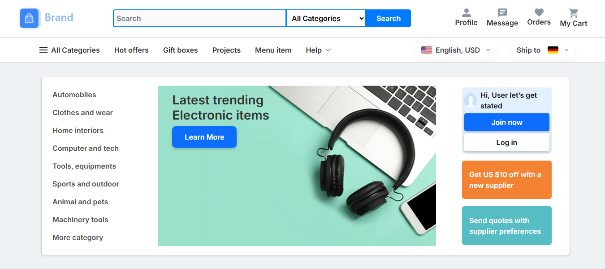
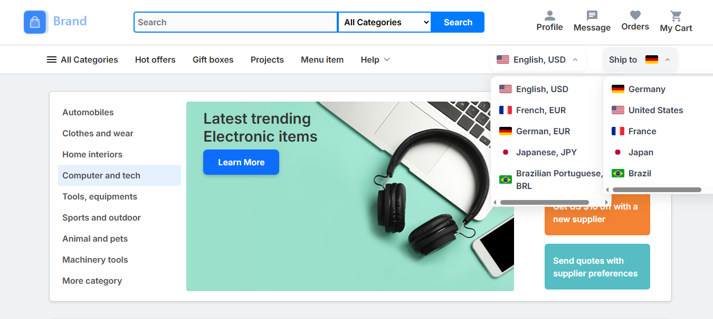
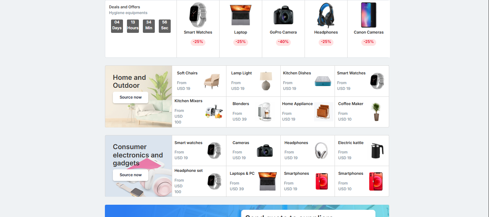
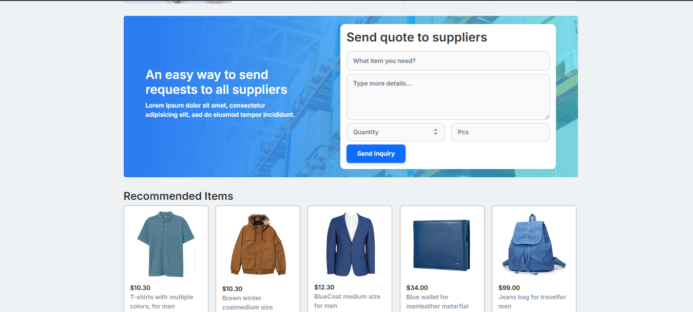
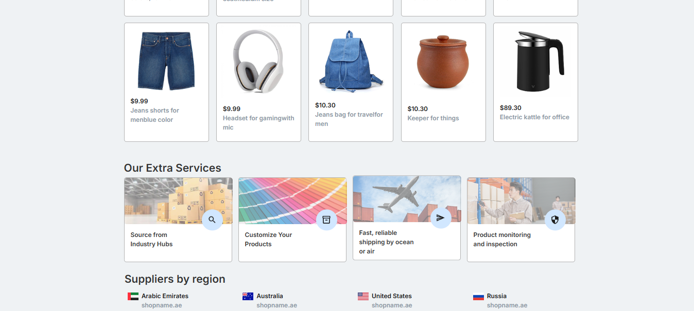
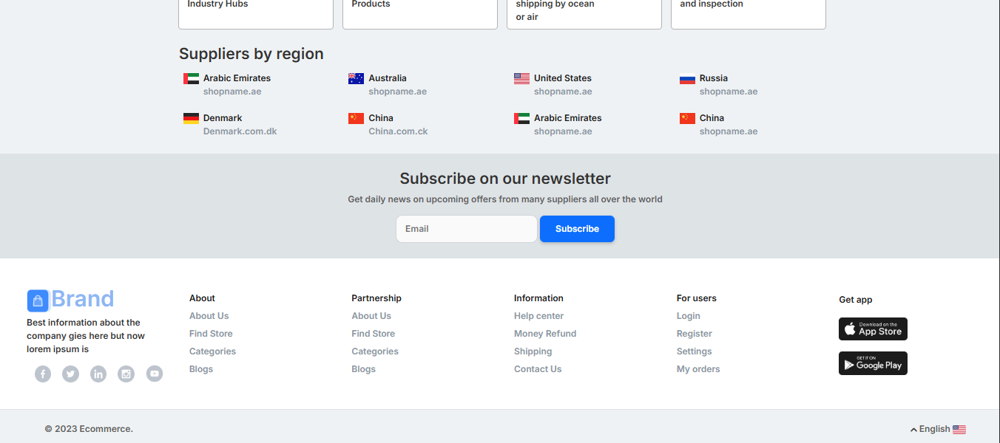

# E-Commerce Frontend (Desktop)









## 📌 Overview
Desktop-only implementation of an eCommerce site with:
- Product listings
- Shopping cart
- Responsive header/footer

## 🛠️ Tech Stack
- HTML5
- CSS3 (Flexbox/Grid)
- JavaScript (Vanilla)

## 🚀 Setup
1. Clone repo:
```
   git clonehttps://github.com/thisisnotasad/E-Commerce-Frontend-Design.git
```
2. Open `index.html` in a web browser.