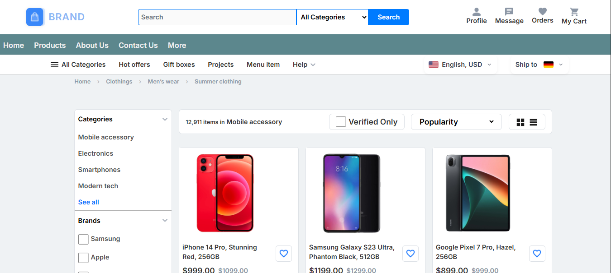
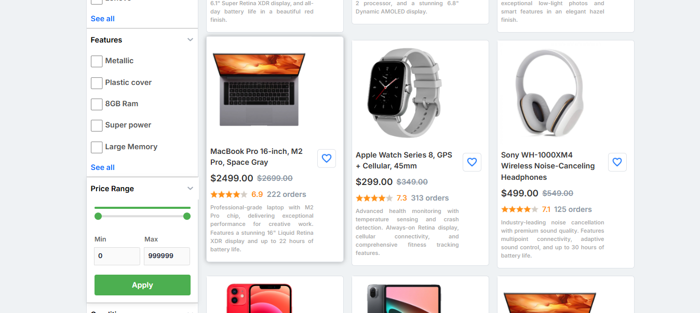
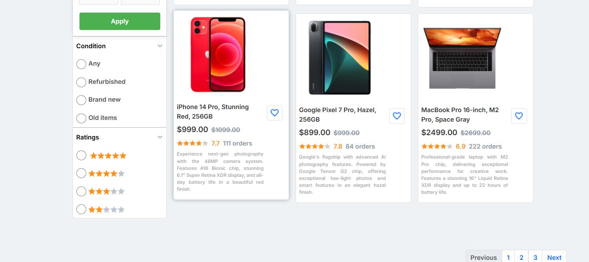
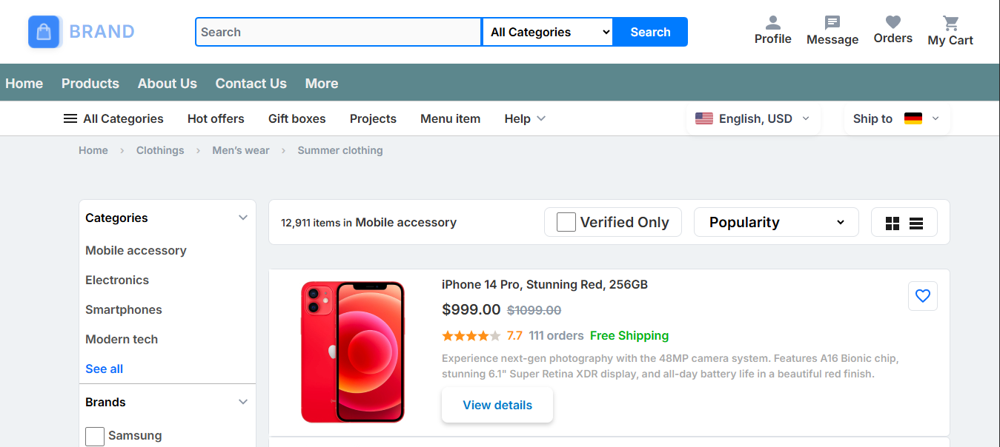
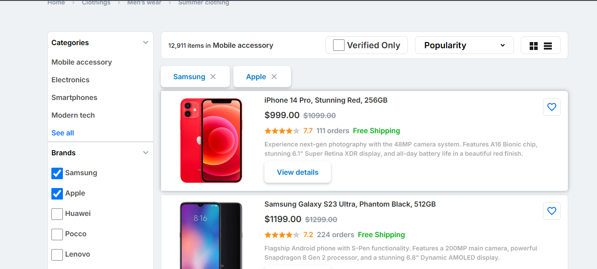
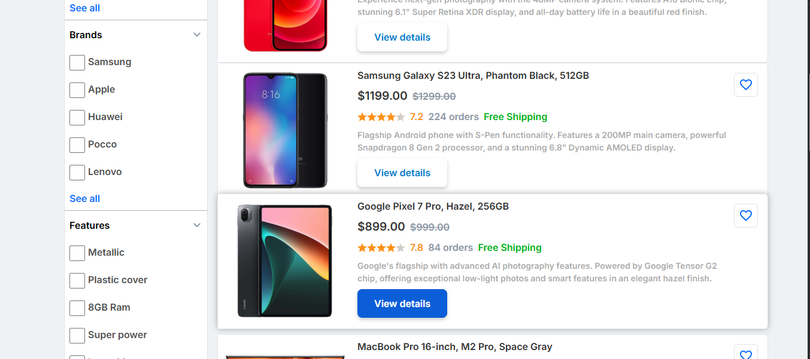
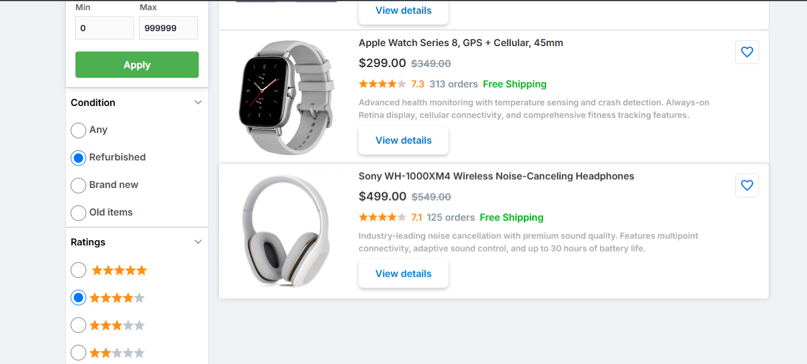
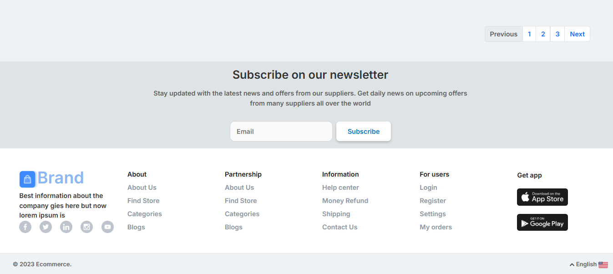

# E-Commerce Frontend (Desktop)


## 📌 Overview
Desktop-only implementation of an eCommerce site with:
- Product listings
- Shopping cart
- Responsive header/footer

## ✅ Progress Timeline

### Week 1: Header & Footer
**Implemented**:
- 🖥️ Desktop-optimized header with:
  - Logo & search bar
  - Navigation dropdowns
- 📜 Multi-column footer with quick links
- **Tech**: HTML5, CSS Flexbox


---

### Week 2: Product Listing Page
**New Features**:
- 🔄 Toggle between grid and list views
- 🔍 Filter sidebar (categories/price)
- 🎨 Consistent card styling











## 📅 Next Steps
-  Product detail pages
-  Shopping cart implementation

## 🛠️ Tech Stack
- HTML5
- CSS3 (Flexbox/Grid)
- JavaScript (Vanilla)

## 🚀 Setup
1. Clone repo:
```
   git clonehttps://github.com/thisisnotasad/E-Commerce-Frontend-Design.git
```
2. Open `index.html` in a web browser.